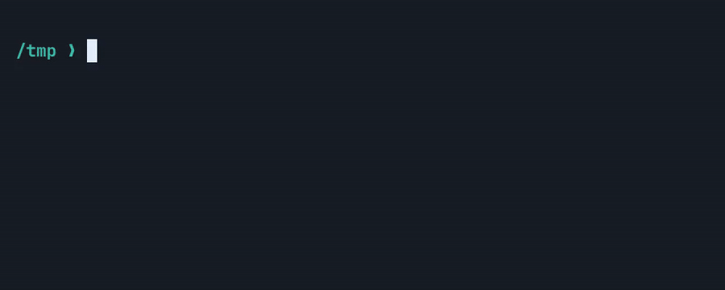

<p align="center">
  
</p>

# OmaPower

OmaPower brings the satisfying particle bursts of
[Hyperpower](https://github.com/vercel/hyperpower) to terminals on Omarchy.
Every printable key launches a compact spray of pixels from the live block
cursor. The default colors move through the white, cyan, blue, indigo, and
purple shades of the Omarchy logo.

The effect runs as a click-through Wayland overlay inside `omarchy-shell`. With
the native Bash and Foot integration, particles follow the real terminal cell
through wrapped lines, directory changes, new prompts, and scaled monitors.
OmaPower never receives the character or command being typed, and its animation
clock stops when no particles are active.

<p align="center">
  
</p>
<p align="center"><sub>Recorded in Foot with OmaPower's default motion and Omarchy color palette.</sub></p>

The plugin targets Omarchy 4.0.1's schema version 1 plugin API. The current
plugin release is 0.6.5.

## Highlights

- Exact Foot cursor positioning through the native Bash Readline hook
- Prompt-aware cleanup, so a finished command cannot leave particles on the
  wrong terminal row
- Adjustable particle count, size, spread, speed, gravity, lifetime, and fade
- Full Omarchy logo, accent, rainbow, and fixed color modes
- Foot, Ghostty, Kitty, and Alacritty focus filtering through Quickshell's
  native Hyprland integration
- One click-through overlay per monitor, using Wayland logical coordinates
- Bash-compatible fallback detection through Wayland's idle-notify protocol
- A hard particle limit with no animation loop while idle
- Optional visual shake of the particle field
- Direct controls through Omarchy shell IPC

## Install

```bash
omarchy plugin add https://github.com/nivekcode/omapower --enable
omarchy restart shell
```

The restart is required after an install, update, or reinstall. OmaPower's
background service stays loaded inside `omarchy-shell`, so a plugin rescan can
update the files without replacing the running service instance.

For local development:

```bash
omarchy plugin validate .
mkdir -p ~/.config/omarchy/plugins
cp -R . ~/.config/omarchy/plugins/io.github.nivekcode.omapower
omarchy plugin enable io.github.nivekcode.omapower
omarchy-shell shell rescanPlugins
```

OmaPower does not edit Omarchy, Hyprland, or terminal configuration.

## Test and control

The bundled helper is optional. Run it from the repository:

```bash
./scripts/omapowerctl burst
./scripts/omapowerctl toggle
./scripts/omapowerctl status
./scripts/omapowerctl set particleCount 7
./scripts/omapowerctl set particleColorMode rainbow
```

The underlying current Omarchy IPC commands are:

```bash
omarchy-shell omapower burst
omarchy-shell omapower enable
omarchy-shell omapower disable
omarchy-shell omapower toggle
omarchy-shell omapower reloadSettings
omarchy-shell omapower status
omarchy-shell omapower set particleSize 5
```

`burst` is intentionally allowed in any focused window. It is a visual test.
Automatic shell-integration events are rejected unless a supported terminal is
focused.

## Typing detection

Wayland does not let an ordinary shell plugin observe another application's
keypresses or caret. That separation is a security feature. OmaPower does not
use `/dev/input`, a global shortcut for every key, accessibility scraping, or
terminal screen capture.

The default `activity` input mode uses Wayland's idle-notify protocol with a
10 ms reset delay. It sees only that user activity resumed, then checks whether
a supported terminal is focused. It does not receive a key code, character, or
device type. This works with Bash and other shells, but it can also create one
burst when mouse activity resumes while a terminal is focused. Continuous
pointer movement does not produce a stream of bursts because the monitor must
be idle for 10 ms before it can resume again.

If the native Bash hook is present, its exact cursor report takes priority even
when a reinstall has reset this setting to `activity`. The matching Wayland
activity event is discarded, so it cannot replace the exact position with the
window approximation.

```bash
./scripts/omapowerctl set inputMode activity
./scripts/omapowerctl set activityResetDelay 10
```

### Optional exact Zsh integration

For Zsh, source the included integration after your line editor configuration:

```zsh
source /path/to/omapower/integrations/omapower.zsh
```

It opens one Unix-socket connection per interactive Zsh and sends the literal
token `burst` after ZLE's built-in `self-insert` widget runs. It never sends the key, line
buffer, command, cursor index, or environment. The plugin checks the focused
window again before rendering. It uses Zsh's bundled `zsh/net/socket` module,
so it does not start a helper process or add a dependency.

Switch to socket-only mode to prevent the Wayland fallback from creating a
second burst for the same key:

```bash
./scripts/omapowerctl set inputMode socket
```

The Zsh hook covers printable self-insert events. It does not add particles for
cursor movement, deletion, completion, or bracketed paste. Fish does not have
an equally small, content-blind hook, so its automatic integration remains
disabled. Manual bursts still work.

### Native Bash and Foot cursor integration

[Hyperpower](https://github.com/vercel/hyperpower) runs inside Hyper and receives
the terminal component's `cursorFrame.x/y` directly. An external Wayland overlay
cannot access Foot's caret. OmaPower's Bash integration loads a small native
Readline function compiled on the local machine. That function calls Readline's
own `rl_insert`, reads the resulting cursor index, and sends numeric cursor and
terminal-grid geometry plus Foot's process ID. It does not run a shell callback
or rewrite `READLINE_LINE` for each key. This keeps Foot's block cursor on the
normal Readline rendering path and prevents another terminal's prompt update
from moving the active cursor.

Install it once, then open a new terminal:

```bash
~/.config/omarchy/plugins/io.github.nivekcode.omapower/scripts/install-bash-integration
```

The installer builds `~/.cache/omapower/omapower-readline.so` against the
installed Bash headers and selects socket mode. Keeping the compiled module out
of the plugin directory prevents an installation-time shell reload. Foot's
terminal API reports the grid's physical pixel size, so the native hook sends
the exact cell width and height with each cursor position. This avoids
accumulated drift in wide windows and on lower terminal rows. After each native
self-insert, the overlay waits 8 ms for Foot to paint and starts the burst at
the leading edge of the reported block cursor. Keys inside one redraw cycle
collapse to the newest position. The native function receives Readline's key
argument because Readline calls it, but it never sends, logs, or retains that
value or the command line. The Unix socket receives cursor-grid numbers and the
terminal process identifier only.
Prompt color and formatting codes are removed using bytewise parsing, so the
system locale cannot count invisible Starship control sequences as cursor cells.
When Bash draws a new prompt, OmaPower removes particles left on the previous
command line before accepting new input.

Each terminal loads its own non-exported integration guard. A Foot window
opened through Super+Enter cannot inherit a stale "already loaded" state from
its parent process.

## Caret position

Generic Wayland and Hyprland do not expose terminal caret coordinates.
Quickshell's toplevel API provides window geometry rather than terminal grid
state. The optional Bash integration closes that gap for Foot by requesting one
standard numeric cursor-position report before each prompt, then combining that
anchor with Readline's post-insert cursor index. The result is the current block
cursor cell without querying the terminal while the user is typing.

Without the Bash integration, the origin is an approximation inside the active
terminal window. By default it is 18 percent across the window and 52 logical
pixels above the bottom edge. Tune these for your prompt and terminal padding:

```bash
./scripts/omapowerctl set originXRatio 0.12
./scripts/omapowerctl set originBottomOffset 64
```

Window geometry comes from Hyprland in global logical coordinates. The overlay
subtracts the selected screen's logical origin, which keeps placement consistent
across monitors with different scales.

## Settings

Settings persist in the plugin's entry in `~/.config/omarchy/shell.json`. The
`set` command writes them through Omarchy's own configuration mutator.

| Setting | Default | Range or values |
| --- | ---: | --- |
| `particlesEnabled` | `true` | boolean |
| `particleCount` | `6` | 1 to 24 |
| `particleLifetime` | `360` | 120 to 2000 ms |
| `particleSize` | `2.4` | 1 to 18 logical px |
| `particleSpread` | `90` | 15 to 500 logical px |
| `initialVelocity` | `200` | 20 to 800 |
| `gravity` | `360` | -500 to 1400 |
| `opacity` | `0.96` | 0.05 to 1 |
| `maximumActiveParticles` | `160` | 8 to 500 |
| `particleTrail` | `false` | boolean |
| `cursorFlash` | `false` | boolean |
| `shakeEnabled` | `false` | boolean |
| `shakeStrength` | `2` | 0 to 12 logical px |
| `shakeDuration` | `90` | 20 to 400 ms |
| `particleColorMode` | `omarchy` | `omarchy`, `accent`, `rainbow`, `fixed` |
| `customParticleColor` | `#ffffff` | six or eight digit hex color |
| `inputMode` | `activity` | `activity`, `socket`, `both` |
| `activityResetDelay` | `10` | 10 to 250 ms |
| `caretTrackingEnabled` | `true` | boolean |
| `terminalPaddingX` | `14` | 0 to 100 logical px |
| `terminalPaddingY` | `14` | 0 to 100 logical px |
| `terminalIdentifiers` | common terminals | JSON array or comma-separated list |
| `originXRatio` | `0.18` | 0 to 1 |
| `originBottomOffset` | `52` | 0 to 400 logical px |

Example terminal list:

```bash
./scripts/omapowerctl set terminalIdentifiers '["foot","my-terminal"]'
```

Shake affects the particle field, not the terminal window. Moving a tiled
Hyprland client for every key can disturb layout and leave geometry behind after
an interrupted animation, so OmaPower does not do that.

## Motion profile

The default burst uses a narrow, balanced upward cone rather than a radial
explosion. Every spark begins at the exact emitter coordinate, then uses
frame-rate-independent velocity, drag, gravity, exponential alpha decay, and a
final eased fade. Particle cores stay square and align to physical pixels so
the effect remains sharp at small sizes. Trails and the cursor flash remain
available as options but are off by default. Successive bursts rotate through
every white, cyan, blue, indigo, and purple shade sampled from the Omarchy logo.

All active particles on a monitor share one vsync-driven framebuffer canvas.
The overlay stays mapped while OmaPower is enabled, which avoids layer-surface
creation on the first character after an idle period.

## Privacy and performance

The Wayland activity monitor exposes no key or pointer data. The socket accepts
the `burst` token, numeric terminal-grid positions, and the terminal process
identifier from optional shell integrations. Events are used immediately and
are not written to disk, logged, transmitted, or kept as a history. The service
stores only a lifetime burst counter for its status output. Disable and
re-enable the plugin to reset it.

Each monitor uses one canvas driven by Qt's vsync-aligned `FrameAnimation`.
Particles share that clock, expired particles are removed in batches, and new
bursts stop at `maximumActiveParticles`. The layer surface has an empty input
region and never requests keyboard focus.

## Development checks

```bash
omarchy plugin validate .
qmllint HyperPower.qml HyperPowerService.qml HyperPowerOverlay.qml HyperPowerCanvas.qml
shellcheck scripts/omapowerctl
```

Use `omarchy-shell shell rescanPlugins` after copying a new local checkout if
the file watcher has not reloaded it. Restart the shell after changing the
keep-loaded service itself:

```bash
omarchy restart shell
```

## License

MIT
