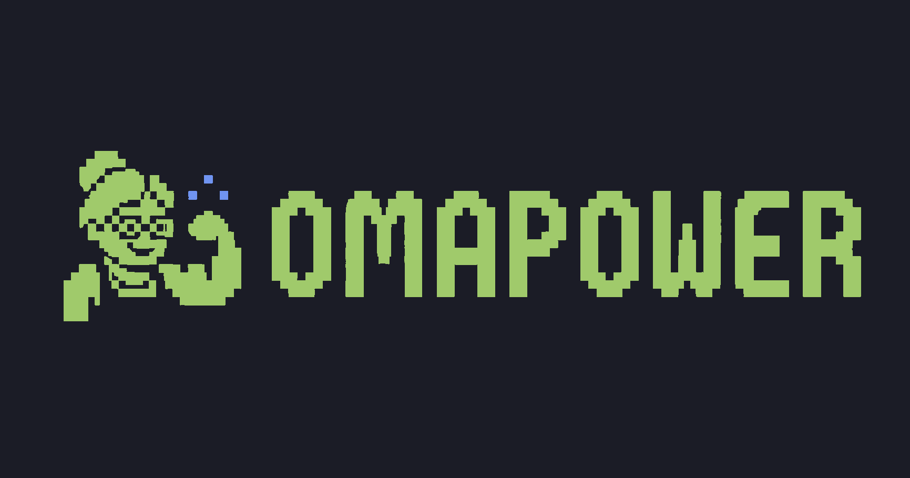

<p align="center">
  
</p>

# OmaPower

OmaPower adds small Hyperpower-style particle bursts to terminal typing in the
Omarchy shell. It runs inside the existing `omarchy-shell` process and uses the
active Omarchy accent color by default.

The plugin targets Omarchy 4.0.1's schema version 1 plugin API. The current
plugin release is 0.4.1.

## What works

- Three to eight animated particles per burst, with randomized size, direction,
  speed, lifetime, gravity, fade, and color
- Automatic Bash-compatible input activity through Wayland's idle-notify
  protocol
- Foot cursor-grid positioning through an optional content-blind Bash prompt
  hook
- Foot, Ghostty, Kitty, and Alacritty focus filtering through Quickshell's
  native Hyprland integration
- One click-through overlay per monitor, using Wayland logical coordinates
- Accent, rainbow, and fixed color modes
- A hard particle limit and no animation loop while idle
- Optional visual shake of the particle field
- Direct controls through Omarchy shell IPC

## Install

```bash
omarchy plugin add https://github.com/nivekcode/omapower --enable
```

For local development:

```bash
omarchy plugin validate .
mkdir -p ~/.config/omarchy/plugins
cp -R . ~/.config/omarchy/plugins/io.github.nivekcode.omapower
omarchy plugin enable io.github.nivekcode.omapower
omarchy-shell shell rescanPlugins
```

OmaPower does not edit Omarchy, Hyprland, or terminal configuration.

## Test and control

The bundled helper is optional. Run it from the repository:

```bash
./scripts/omapowerctl burst
./scripts/omapowerctl toggle
./scripts/omapowerctl status
./scripts/omapowerctl set particleCount 7
./scripts/omapowerctl set particleColorMode rainbow
```

The underlying current Omarchy IPC commands are:

```bash
omarchy-shell omapower burst
omarchy-shell omapower enable
omarchy-shell omapower disable
omarchy-shell omapower toggle
omarchy-shell omapower reloadSettings
omarchy-shell omapower status
omarchy-shell omapower set particleSize 5
```

`burst` is intentionally allowed in any focused window. It is a visual test.
Automatic shell-integration events are rejected unless a supported terminal is
focused.

## Typing detection

Wayland does not let an ordinary shell plugin observe another application's
keypresses or caret. That separation is a security feature. OmaPower does not
use `/dev/input`, a global shortcut for every key, accessibility scraping, or
terminal screen capture.

The default `activity` input mode uses Wayland's idle-notify protocol with a
30 ms reset delay. It sees only that user activity resumed, then checks whether
a supported terminal is focused. It does not receive a key code, character, or
device type. This works with Bash and other shells, but it can also create one
burst when mouse activity resumes while a terminal is focused. Continuous
pointer movement does not produce a stream of bursts because the monitor must
be idle for 30 ms before it can resume again.

```bash
./scripts/omapowerctl set inputMode activity
./scripts/omapowerctl set activityResetDelay 30
```

### Optional exact Zsh integration

For Zsh, source the included integration after your line editor configuration:

```zsh
source /path/to/omapower/integrations/omapower.zsh
```

It opens one Unix-socket connection per interactive Zsh and sends the literal
token `burst` after ZLE's built-in `self-insert` widget runs. It never sends the key, line
buffer, command, cursor index, or environment. The plugin checks the focused
window again before rendering. It uses Zsh's bundled `zsh/net/socket` module,
so it does not start a helper process or add a dependency.

Switch to socket-only mode to prevent the Wayland fallback from creating a
second burst for the same key:

```bash
./scripts/omapowerctl set inputMode socket
```

The Zsh hook covers printable self-insert events. It does not add particles for
cursor movement, deletion, completion, or bracketed paste. Fish does not have
an equally small, content-blind hook, so its automatic integration remains
disabled. Manual bursts still work.

### Exact Bash and Foot cursor integration

[Hyperpower](https://github.com/vercel/hyperpower) runs inside Hyper and receives
the terminal component's `cursorFrame.x/y` directly. An external Wayland overlay
cannot access Foot's caret. OmaPower's
Bash integration wraps Readline's printable self-insert action. For each typed
character, it sends only four numbers: cursor row, cursor column, terminal rows,
and terminal columns. The integration captures the terminal position once before
each prompt, then combines that stable anchor with the prompt's display width and
Readline's post-insert cursor index to recover the visible cursor cell. It never
injects a terminal query while Readline is processing a keystroke.
It does not send the character or command line. The installer switches OmaPower
to `socket` mode so fast typing cannot be merged by Wayland's idle monitor.

Install it once, then open a new terminal:

```bash
~/.config/omarchy/plugins/io.github.nivekcode.omapower/scripts/install-bash-integration
```

Readline invokes the hook after inserting a printable character. The overlay
fits the reported terminal grid to the live Foot client geometry, waits 25 ms
for Foot to redraw, and starts the burst at the leading edge of the visible
block cursor. Backspacing or moving the cursor before typing does not accumulate
positioning error. The hook
does not emit particles for deletion, completion, bracketed paste, or non-ASCII
input. It never sends the command line or typed character.

## Caret position

Generic Wayland and Hyprland do not expose terminal caret coordinates.
Quickshell's toplevel API provides window geometry rather than terminal grid
state. The optional Bash integration closes that gap for Foot by requesting
one standard numeric cursor-position report before each prompt and using
Readline's own cursor index for every printable insertion.

Without the Bash integration, the origin is an approximation inside the active
terminal window. By default it is 18 percent across the window and 52 logical
pixels above the bottom edge. Tune these for your prompt and terminal padding:

```bash
./scripts/omapowerctl set originXRatio 0.12
./scripts/omapowerctl set originBottomOffset 64
```

Window geometry comes from Hyprland in global logical coordinates. The overlay
subtracts the selected screen's logical origin, which keeps placement consistent
across monitors with different scales.

## Settings

Settings persist in the plugin's entry in `~/.config/omarchy/shell.json`. The
`set` command writes them through Omarchy's own configuration mutator.

| Setting | Default | Range or values |
| --- | ---: | --- |
| `particlesEnabled` | `true` | boolean |
| `particleCount` | `6` | 1 to 24 |
| `particleLifetime` | `500` | 120 to 2000 ms |
| `particleSize` | `2.5` | 1 to 18 logical px |
| `particleSpread` | `90` | 15 to 500 logical px |
| `initialVelocity` | `175` | 20 to 800 |
| `gravity` | `290` | -500 to 1400 |
| `opacity` | `0.95` | 0.05 to 1 |
| `maximumActiveParticles` | `160` | 8 to 500 |
| `particleTrail` | `false` | boolean |
| `cursorFlash` | `false` | boolean |
| `shakeEnabled` | `false` | boolean |
| `shakeStrength` | `2` | 0 to 12 logical px |
| `shakeDuration` | `90` | 20 to 400 ms |
| `particleColorMode` | `accent` | `accent`, `rainbow`, `fixed` |
| `customParticleColor` | `#ffffff` | six or eight digit hex color |
| `inputMode` | `activity` | `activity`, `socket`, `both` |
| `activityResetDelay` | `30` | 10 to 250 ms |
| `caretTrackingEnabled` | `true` | boolean |
| `terminalPaddingX` | `14` | 0 to 100 logical px |
| `terminalPaddingY` | `14` | 0 to 100 logical px |
| `terminalIdentifiers` | common terminals | JSON array or comma-separated list |
| `originXRatio` | `0.18` | 0 to 1 |
| `originBottomOffset` | `52` | 0 to 400 logical px |

Example terminal list:

```bash
./scripts/omapowerctl set terminalIdentifiers '["foot","my-terminal"]'
```

Shake affects the particle field, not the terminal window. Moving a tiled
Hyprland client for every key can disturb layout and leave geometry behind after
an interrupted animation, so OmaPower does not do that.

## Motion profile

The default burst uses a narrow, balanced upward cone rather than a radial
explosion. Every spark begins at the exact emitter coordinate, then uses
frame-rate-independent velocity, drag, gravity, exponential alpha decay, and a
final eased fade. Particle cores stay square and align to physical pixels so
the effect remains sharp at small sizes. Trails and the cursor flash remain
available as options but are off by default.

All active particles on a monitor share one vsync-driven framebuffer canvas.
The overlay stays mapped while OmaPower is enabled, which avoids layer-surface
creation on the first character after an idle period.

## Privacy and performance

The Wayland activity monitor exposes no key or pointer data. The socket accepts
one event word and ignores everything except `burst`. Events
are used immediately and are not written to disk, logged, transmitted, or kept
as a history. The service stores only a lifetime burst counter for its status
output. Disable and re-enable the plugin to reset it.

Each monitor uses one canvas driven by Qt's vsync-aligned `FrameAnimation`.
Particles share that clock, expired particles are removed in batches, and new
bursts stop at `maximumActiveParticles`. The layer surface has an empty input
region and never requests keyboard focus.

## Development checks

```bash
omarchy plugin validate .
qmllint HyperPower.qml HyperPowerService.qml HyperPowerOverlay.qml HyperPowerCanvas.qml
shellcheck scripts/omapowerctl
```

Use `omarchy-shell shell rescanPlugins` after copying a new local checkout if
the file watcher has not reloaded it. `omarchy restart shell` is the last resort.

## License

MIT
